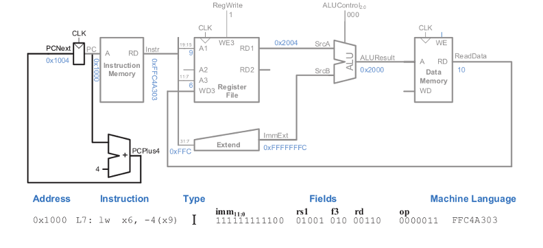

# RISC-V Single Cycle Microarchitecture

## Overview
This repository contains the implementation details and design of a RISC-V single-cycle microarchitecture. The document explores the components, state elements, and datapath development for handling various RISC-V instruction types, including Load, Store, and Register-based operations.

---


## Key Components

### 1. Arithmetic Logic Unit (ALU)
The ALU is a central component responsible for performing arithmetic and logical operations. Its design includes:
- **Arithmetic Operations:** Addition, subtraction, and set-on-less-than (SLT).
- **Logical Operations:** AND and OR.
- **Control Signal:** A 3-bit `ALUControl` determines the operation mode.
- **Multiplexing Logic:** Logical operations are selected when `ALUControl[1]` is high, while arithmetic operations are selected when it is low.
- **Zero Flag:** A 1-bit flag indicating if the output is zero.

The design is modular, using multiplexers to select outputs from logical and arithmetic blocks based on the control signal, simplifying implementation and ensuring scalability.


---

### 2. Control Unit
The Control Unit orchestrates the operation of the microarchitecture. Key features include:
- **Instruction Decoding:** Separates main decoding and ALU decoding into modular combinational blocks.
  - **Main Decoder:** Generates control signals based on the opcode.
  - **ALU Decoder:** Refines operations using the function fields (`funct3`, `funct7`) and opcode.
- **Control Signal Outputs:** Control signals dictate register writes, memory access, and ALU operations.

The unit ensures efficient execution of RISC-V instruction types by isolating combinational logic into reusable modules.

---

### 3. Designing Microarchitecture - State Elements
State elements form the backbone of the processor, maintaining the current and next state:
- **Components:**
  - **Program Counter (PC):** Holds the address of the current instruction.
  - **Instruction Memory:** Stores program instructions.
  - **Register File:** Provides registers for source and destination operands.
  - **Data Memory:** Handles load and store operations.
- **Synchrony:** Elements are updated on the rising edge of the clock, enabling a synchronized state transition.

The modular design, separating instruction and data memories, ensures clarity and efficient memory management.

---

### 4. Designing Microarchitecture - Load Word Instruction
The datapath for the `lw` (load word) instruction involves:
- **Address Calculation:** Combines the base address from the source register (`rs1`) with a sign-extended immediate offset.
- **Memory Access:** Uses the calculated address to fetch data from memory.
- **Data Writeback:** Transfers the fetched data to the destination register (`rd`).
- **PC Update:** Increments the program counter (`PC`) by 4 for the next instruction.



**Explanation of Figure**:
- The `PC` provides the address to fetch the instruction from the instruction memory.
- The `Extend` block sign-extends the immediate value.
- The `ALU` calculates the effective memory address by adding the base address (`rs1`) to the immediate value.
- The calculated address is used to fetch the data from the data memory, which is then written to the destination register (`rd`).

---

### 5. Designing Microarchitecture - Store Word Instruction
The datapath for the `sw` (store word) instruction includes:
- **Address Calculation:** Similar to `lw`, using the base address (`rs1`) and sign-extended offset.
- **Data Write:** Reads the value from the second source register (`rs2`) and writes it to the calculated memory address.
- **Control Signals:**
  - `MemWrite = 1`: Enables memory writing.
  - `RegWrite = 0`: Ensures no changes to registers during store operations.


**Explanation of Figure**:
- The `PC` provides the address to fetch the instruction from the instruction memory.
- The `Extend` block sign-extends the immediate value.
- The `ALU` calculates the effective memory address by adding the base address (`rs1`) to the immediate value.
- The data from `rs2` is written to the calculated address in the data memory, controlled by the `MemWrite` signal.

---

## Simulation Using Icarus Verilog
This repository supports simulation using **Icarus Verilog**. Follow the steps below to simulate the design:

1. Compile the Verilog files along with the testbench:
   ```bash
   iverilog -o SingleCycleMicro Single_Cycle_Top.v Single_Cycle_Top_Tb.v

 ## References

- [RISCV Single Core Playlist by Ameya Walimbe](https://www.youtube.com/watch?v=BVvDHhG0RoA&list=PL5AmAh9QoSK7Fwk9vOJu-3VqBng_HjGFc)
  


